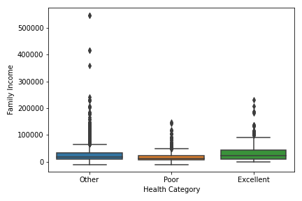

# Elderly Medicare Analysis

An analysis of data from “Demand for Medical Care by the Elderly: A Finite Mixture Approach” Cameron, A.C. and Trivedi P.K. (1998)

  

                                     
